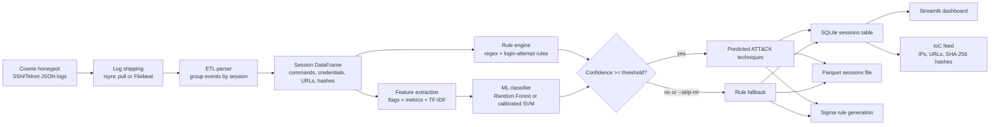
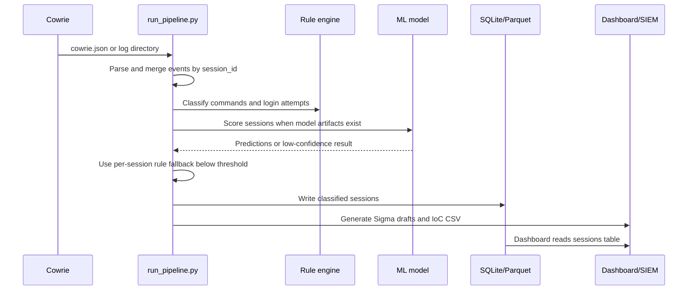

# Honeypot Attack Classifier

An end-to-end Cowrie honeypot analysis pipeline that converts JSON events into
session records, maps behavior to MITRE ATT&CK techniques, optionally applies
a multi-label ML classifier, and publishes analyst-facing and SIEM-facing
outputs.

The repository is designed for controlled security research. The bundled log
file is synthetic. Deploy a real honeypot only on an isolated network with no
route to production or internal systems.

## Architecture





### Processing stages

1. **Capture and shipping:** Cowrie writes one JSON object per line. The
   deployment files support pull-based rsync over SSH or Filebeat.
2. **ETL:** `etl/etl_parser.py` tolerates malformed lines, groups interleaved
   events by `session`, removes terminal escape sequences, deduplicates only
   consecutive duplicate commands, and serializes list fields as JSON strings.
3. **Rules:** `features/attack_rules.py` and `features/rule_classifier.py`
   provide the deterministic baseline. Brute force (`T1110`) is emitted at
   three or more login attempts; command techniques are regex-based.
4. **Features and ML:** `features/feature_extractor.py` combines boolean
   critical-command flags, session metrics, and word-level TF-IDF unigrams and
   bigrams. Training persists the fitted vectorizer so inference uses the same
   feature columns.
5. **Persistence and detection:** classified sessions are written to SQLite
   and Parquet. Repeated techniques across at least `--min-sessions` sessions
   can become experimental Sigma rules; source IPs, download URLs, and hashes
   become an IoC CSV.
6. **Analysis:** the Streamlit app provides an executive summary, ATT&CK
   matrix, session explorer, and IoC/payload view.

## Repository layout

```text
run_pipeline.py             Full ETL -> rules -> ML -> storage -> detections
etl/etl_parser.py           Cowrie JSON -> session records -> SQLite/Parquet
features/attack_rules.py    ATT&CK technique regex catalog
features/rule_classifier.py Deterministic session classifier
features/feature_extractor.py ML flags, metrics, and TF-IDF features
ml/labeling_schema.py       Export/import human annotation CSVs
ml/train_pipeline.py        Bootstrap labels, cross-validation, model training
ml/ml_classifier.py         Model inference with rule fallback
detection/generate_sigma.py Experimental Sigma rules and IoC feed
dashboard/app.py            Streamlit analytics dashboard
infra/                      Cowrie provisioning, NAT, and egress controls
infra/log_shipping/         rsync/Filebeat shipping and systemd timers
tests/                      ETL, rule-engine, and ML fallback tests
data/                       Synthetic logs and generated/sample data outputs
models/                     Generated model artifacts (not required for rules)
```

## Installation

From the repository root:

```bash
python3 -m venv .venv
source .venv/bin/activate
python -m pip install -r requirements-dev.txt
```

`requirements-dev.txt` includes the runtime dependencies from
`requirements.txt` plus `pytest`. Use `python -m pip` and `python -m pytest`
so the active virtual environment is used.

## Quickstart

Run the test suite:

```bash
python -m pytest tests/ -v
```

Train a small smoke-test model from the bundled sample. These labels are
generated by the rule engine and are not human ground truth:

```bash
python ml/train_pipeline.py \
  --raw-logs data/sample_cowrie_logs/cowrie.json \
  --model-dir models \
  --folds 3
```

Run the complete pipeline. `--raw-logs` accepts either one JSON file or a
directory containing `*.json*` files. `--parquet` is a file path, not a
directory:

```bash
python run_pipeline.py \
  --raw-logs data/sample_cowrie_logs/cowrie.json \
  --db data/sqlite/sessions.db \
  --parquet data/parquet/sessions.parquet \
  --model-dir models \
  --sigma-out-dir detection/sigma_rules \
  --ioc-out-csv data/ioc_feed.csv
```

For a deterministic rule-only run:

```bash
python run_pipeline.py \
  --raw-logs data/sample_cowrie_logs/cowrie.json \
  --db data/sqlite/sessions.db \
  --parquet data/parquet/sessions.parquet \
  --skip-ml
```

Start the dashboard against the generated database:

```bash
streamlit run dashboard/app.py -- --db data/sqlite/sessions.db
```

The dashboard caches data for 60 seconds. Use its refresh control after a
pipeline run. It reads `predicted_techniques` when present and otherwise uses
`rule_techniques`.

## Command reference

### Standalone ETL

This command is useful when only storage is needed. Its argument names differ
from the orchestrator:

```bash
python etl/etl_parser.py \
  --input data/sample_cowrie_logs/cowrie.json \
  --out-db data/sqlite/sessions.db \
  --out-parquet data/parquet/sessions.parquet
```

### Rule classification on an existing database

```bash
python features/rule_classifier.py \
  --db data/sqlite/sessions.db \
  --table sessions
```

### Offline feature export

```bash
python features/feature_extractor.py \
  --db data/sqlite/sessions.db \
  --out-parquet data/parquet/features.parquet \
  --max-features 300
```

### Human labeling and model training

Export sessions for review:

```bash
python ml/labeling_schema.py \
  --db data/sqlite/sessions.db \
  --out-csv data/labels_for_annotation.csv
```

Fill `confirmed_techniques` with comma-separated IDs such as
`T1110,T1105,T1082`, or use `NONE` for a reviewed session with no technique.
Blank values mean not reviewed and preserve the bootstrap label.

Train with reviewed labels:

```bash
python ml/train_pipeline.py \
  --db data/sqlite/sessions.db \
  --labels-csv data/labels_for_annotation.csv \
  --model-dir models \
  --model-type rf \
  --folds 5 \
  --max-features 300
```

Supported model types are `rf` (Random Forest) and `svm` (calibrated
LinearSVC). Training writes these three files to `--model-dir`:

```text
model.joblib          One-vs-rest multi-label classifier
vectorizer.joblib     Fitted TF-IDF vectorizer
feature_meta.joblib   Feature columns and ATT&CK class metadata
```

Run inference separately on an existing database:

```bash
python ml/ml_classifier.py \
  --sessions-db data/sqlite/sessions.db \
  --model-dir models \
  --threshold 0.70 \
  --out-csv data/predictions.csv
```

Each session uses ML only when its maximum predicted probability reaches the
threshold. Otherwise it is classified independently by the rule engine and is
marked `rule_fallback`. A model failure falls back for all sessions.

### Sigma and IoC generation

```bash
python detection/generate_sigma.py \
  --db data/sqlite/sessions.db \
  --technique-col predicted_techniques \
  --min-sessions 2 \
  --sigma-out-dir detection/sigma_rules \
  --ioc-out-csv data/ioc_feed.csv
```

Use `--technique-col rule_techniques` for a rule-only database. Sigma output is
`status: experimental`; review false positives before SIEM deployment.

## Session data contract

The `sessions` table and Parquet output contain the ETL fields below. The
pipeline appends classification fields when ML is used.

| Field | Meaning |
| --- | --- |
| `session_id` | Cowrie session identifier and primary join key |
| `src_ip` | Source address observed by Cowrie |
| `protocol` | Session protocol, normally SSH or Telnet |
| `start_time`, `end_time` | Cowrie timestamps |
| `session_duration` | Duration in seconds, backfilled from timestamps when needed |
| `username`, `password` | First observed failed credentials or successful credentials |
| `login_attempts`, `login_success` | Authentication activity |
| `command_sequence` | JSON-encoded ordered command list |
| `urls_downloaded` | JSON-encoded download URL list |
| `file_hashes` | JSON-encoded downloaded-file hash list |
| `command_count` | Number of retained commands |
| `rule_techniques` | JSON-encoded deterministic ATT&CK IDs |
| `predicted_techniques` | JSON-encoded ML or fallback ATT&CK IDs |
| `confidence` | Maximum model probability, rounded to four decimals |
| `source` | `ml` or `rule_fallback` |

## ATT&CK detections

The rule catalog currently covers these behavior families:

| Technique IDs | Examples |
| --- | --- |
| `T1110` | Three or more login attempts in one session |
| `T1059.004`, `T1059.006` | Unix shell and Python execution |
| `T1105`, `T1140` | Downloading tools and Base64 decoding |
| `T1222`, `T1053.003` | Permission changes and cron persistence |
| `T1082`, `T1083`, `T1057`, `T1087` | System, file, process, and account discovery |
| `T1003.008` | Reading `/etc/shadow` |
| `T1070.002`, `T1070.003` | Clearing system logs and shell history |
| `T1041`, `T1071.001` | Exfiltration and IP-based web protocol activity |
| `T1496`, `T1489`, `T1489.001` | Resource hijacking, service stop, and destructive `rm -rf` |

One command may map to multiple techniques. For example, a download piped to
an interpreter can produce both transfer and execution-related detections.
The exact regexes are the source of truth in `features/attack_rules.py`.

## Deployment and isolation

The `infra/` files are a deployment reference for Ubuntu 22.04:

1. Place the instance in an isolated VPC/VLAN with no route to production or
   internal networks. Apply cloud-provider firewall and bandwidth limits.
2. Replace `REPLACE_WITH_YOUR_ADMIN_PUBLIC_KEY` in `infra/cloud-init.yaml`
   before using it as instance user-data. It disables root/password SSH and
   moves administrator SSH to port `22222`.
3. As the `cowrie` user, run `infra/setup_cowrie.sh`. Cowrie listens on
   `2222`/`2223` internally and writes JSON to
   `var/log/cowrie/cowrie.json`.
4. As root, run `infra/iptables-nat.sh` to redirect public `22`/`23` to
   Cowrie's high ports, then run `infra/egress-restrict.sh`.

The egress policy allows loopback, established connections, DNS, NTP, HTTP,
and HTTPS, and drops/logs other outbound traffic. HTTP/HTTPS are allowed for
optional payload retrieval; disable or narrow those rules when that capability
is not required. These host controls are defense in depth, not a substitute
for network isolation.

## Automated log shipping

The recommended path is pull-based rsync from the processing server:

1. Copy `infra/log_shipping/rsync_pull_logs.sh` to the processing host and
   set `HONEYPOT_HOST`, `HONEYPOT_USER`, `SSH_KEY`, and local directories.
2. Add the line from `honeypot_authorized_keys_snippet.txt` to the Cowrie
   user's `authorized_keys` on the honeypot. Replace the example public key.
   The key is restricted to read-only `rrsync` access to Cowrie's `var/`
   directory and cannot open a shell, forward ports, or use agent/X11
   forwarding.
3. Install `cowrie-log-sync.service` and `.timer` on the processing server.
   The timer runs every five minutes.
4. Install `honeypot-pipeline.service` and `.timer` there as well. The timer
   runs every ten minutes and points the pipeline at the synced log directory.

Example systemd installation:

```bash
sudo cp infra/log_shipping/cowrie-log-sync.{service,timer} /etc/systemd/system/
sudo cp infra/log_shipping/honeypot-pipeline.{service,timer} /etc/systemd/system/
sudo systemctl daemon-reload
sudo systemctl enable --now cowrie-log-sync.timer honeypot-pipeline.timer
```

`infra/log_shipping/filebeat-cowrie.yml` is an alternative real-time design.
It requires an explicit, narrowly scoped honeypot egress exception to reach
the processing server or Logstash, so it is less isolated than pull-based
shipping.

## Safety and operating notes

- Treat source IPs, credentials, URLs, and downloaded hashes as potentially
  hostile input. Do not execute captured payloads on the processing host.
- The sample data is synthetic and is suitable for tests and smoke runs only.
- Bootstrap-only ML metrics measure agreement with the rule engine, not real
  detection quality. Collect human-reviewed labels before trusting model
  performance or using predictions for automated response.
- Sigma rules are generated only for supported templates and recurring
  techniques. Tune their scope and false positives before production use.
- `load_logs()` merges the same session across rotated `*.json*` files, but
  each pipeline run replaces the SQLite `sessions` table and rewrites the
  Parquet output from the input currently supplied.

## Tests

The test suite covers malformed and interleaved Cowrie events, ANSI/control
character cleanup, session merging, JSON serialization, representative ATT&CK
rules, confidence-based ML fallback, and model failure behavior.

```bash
python -m pytest tests/ -v
```
# Honeypot & Automated ATT&CK Technique Classification System

End-to-end pipeline: Cowrie honeypot capture -> ETL -> rule-based and ML
MITRE ATT&CK auto-tagging -> Streamlit dashboard -> Sigma/IoC detection output.

## Layout

```
run_pipeline.py     Orchestrates the full ETL -> classify -> Sigma/IoC run
infra/               Cloud-init + hardening scripts to deploy Cowrie on a VPS
infra/log_shipping/  rsync-over-SSH + systemd timers (+ Filebeat alt.) to
                     ship logs from the honeypot to the processing server
etl/                 etl_parser.py — cowrie.json -> SQLite/Parquet sessions
features/            attack_rules.py, rule_classifier.py, feature_extractor.py
ml/                  labeling_schema.py, train_pipeline.py, ml_classifier.py
dashboard/           app.py — Streamlit multi-page analytics UI
detection/           generate_sigma.py — Sigma rules + IoC feed
tests/               pytest suite (etl / rule engine / ML fallback)
data/                sample_cowrie_logs (synthetic), sqlite/, parquet/ outputs
models/              trained model.joblib + vectorizer.joblib + feature_meta.joblib
```

## Quickstart (local, using the bundled synthetic sample logs)

```bash
python3 -m venv .venv && source .venv/bin/activate
pip install -r requirements-dev.txt   # requirements.txt + pytest

# Run the tests
python -m pytest tests/ -v

# Bootstrap a model from the rule engine's own output (see "Ground truth
# and training" below for why this is a smoke-test model, not a trustworthy
# one, until real sessions get human-reviewed labels).
cd ml && python train_pipeline.py \
  --raw-logs ../data/sample_cowrie_logs \
  --model-dir ../models \
  --folds 3 && cd ..

# One-shot: parse raw logs -> rule engine -> ML (with rule fallback) ->
# SQLite/Parquet -> Sigma rules + IoC feed.
python run_pipeline.py \
  --raw-logs data/sample_cowrie_logs \
  --db data/sqlite/sessions.db \
  --parquet data/parquet/sessions.parquet \
  --model-dir models \
  --sigma-out-dir detection/sigma_rules \
  --ioc-out-csv data/ioc_feed.csv
# (--skip-ml, or simply an empty/missing --model-dir, runs rule-engine-only)

# Dashboard
cd dashboard && streamlit run app.py -- --db ../data/sqlite/sessions.db && cd ..
```

`run_pipeline.py` is idempotent — `etl_parser.py`'s session merge means
re-running it over the same (or overlapping) raw logs just reprocesses the
same sessions, so it's safe to schedule on a timer (see log shipping below)
without deduping logs yourself first.

## Ground truth and training (Phase 4)

`ml/train_pipeline.py` builds its training labels by running the Phase 3
rule engine over parsed sessions — this is a **bootstrap label**, not a
human-verified one. A model trained only on bootstrap labels has learned to
reproduce the rule engine's own regexes, not to generalize past them; it
will not catch anything the rules don't already catch. Treat a
rule-engine-bootstrapped model as a pipeline smoke test.

To get a model that's actually worth trusting:

1. `cd ml && python labeling_schema.py --db ../data/sqlite/sessions.db --out-csv ../data/labels_for_annotation.csv`
2. Have a human fill in (or correct) the `confirmed_techniques` column —
   directly in the CSV, or via a Label Studio import/export round-trip.
3. `python train_pipeline.py --db ../data/sqlite/sessions.db --labels-csv ../data/labels_for_annotation.csv --model-dir ../models`
   — sessions present in the labels CSV with a non-blank
   `confirmed_techniques` override the rule-engine bootstrap; sessions not
   yet reviewed keep the bootstrap label rather than being silently wiped.

`train_pipeline.py` reports K-Fold cross-validated precision/recall/F1 per
ATT&CK technique (folds auto-shrink for tiny datasets, with a warning) and
serializes `model.joblib`, `vectorizer.joblib`, and `feature_meta.joblib` to
`--model-dir`. `ml/ml_classifier.py` loads that exact fitted TF-IDF
vectorizer at inference time — inference features are computed in the same
column space training used, rather than each run re-fitting its own
vectorizer on whatever's on hand (a real train/inference skew that existed
before `train_pipeline.py` was split out — see git history if curious).
`predict_with_fallback()` falls back to the rule engine per-session when the
model's max predicted probability is below `--threshold` (default 0.70).

## Deploying the real honeypot (Phase 1)

1. Provision an Ubuntu 22.04 VPS **inside an isolated VPC/VLAN with no route
   to any internal/production network.** This is the single most important
   control — everything else in `infra/` is defense in depth on top of it.
2. Pass `infra/cloud-init.yaml` as user-data (replace the placeholder SSH
   public key first). This moves the real admin SSH to port 22222 and opens
   only 22222/22/23 at the firewall.
3. SSH in on 22222, then as the `cowrie` user run `infra/setup_cowrie.sh` to
   install and configure Cowrie (binds to 2222/2223 internally, JSON logging
   enabled).
4. As root, run `infra/iptables-nat.sh` (forwards 22->2222, 23->2223) then
   `infra/egress-restrict.sh` (default-deny outbound except DNS/NTP/HTTP/S —
   stops the box being usable for outbound DDoS or lateral pivoting even if
   an attacker gets a real shell).

## Automated log shipping (Phase 1)

`infra/log_shipping/` has two options to get `cowrie.json` + captured
payloads from the honeypot to wherever `run_pipeline.py` runs:

- **rsync over SSH (default, recommended)** — `rsync_pull_logs.sh` runs ON
  THE PROCESSING SERVER and *pulls* from the honeypot, using a key
  restricted on the honeypot side to read-only rsync of Cowrie's `var/`
  directory (`honeypot_authorized_keys_snippet.txt` — via `rrsync`, no
  shell, no port/agent/X11 forwarding). Pull-based means a compromised
  honeypot never holds credentials that can write to the processing server.
  `cowrie-log-sync.{service,timer}` runs it every 5 minutes via systemd;
  `honeypot-pipeline.{service,timer}` runs `run_pipeline.py` itself every 10
  minutes after that. Install both pairs under `/etc/systemd/system/` on the
  processing server and `systemctl enable --now` the timers.
- **Filebeat (alternative, real-time)** — `filebeat-cowrie.yml`, installed
  ON THE HONEYPOT, ships events as they're written instead of polling. This
  needs *outbound* network access from the honeypot to the processing
  server, which means carving an explicit exception into
  `egress-restrict.sh`'s default-deny — noted inline in the config.

## Notes

- `data/sample_cowrie_logs/cowrie.json` is synthetic data for pipeline
  development/testing — replace with real captures before drawing
  conclusions from the dashboard or shipping Sigma rules.
- Sigma rules in `detection/generate_sigma.py` are `status: experimental` —
  tune false-positive scope (especially around `wget`/`curl`/`chmod`, which
  are common in legitimate sysadmin activity) before deploying to a
  production SIEM. `run_pipeline.py --min-sessions` controls how many
  independent sessions must show a pattern before a rule is emitted at all.
- The dashboard (`dashboard/app.py`) reads directly from the SQLite sessions
  table, cached for 60s (or refreshed immediately via the sidebar button),
  so it picks up whatever `run_pipeline.py` last wrote — including
  `predicted_techniques`/`confidence`/`source` when a model was used, or
  `rule_techniques` alone in rule-only mode.
